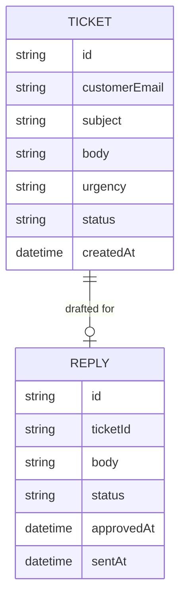

# Domain Model

A ticket moves from customer submission, through AI triage, to a human-approved and sent reply.

- **Ticket** — `urgency` is one of Low, Medium, High, Critical, set by the triage agent when the ticket is created. `status` moves `submitted` → `triaged` → `replied`.
- **Reply** — the AI-drafted text for one ticket. `status` moves `draft` → `approved` → `sent`; a support agent may edit `body` before approving.

