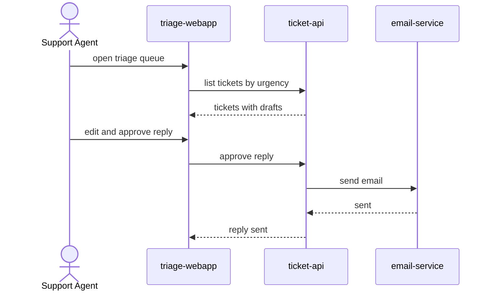

# Reply review and approval

A support agent reviews the triaged queue, edits a draft if needed, and approves it for sending.

```mermaid
sequenceDiagram
    actor SupportAgent as Support Agent
    participant triage-webapp
    participant ticket-api
    participant email-service

    SupportAgent->>triage-webapp: open triage queue
    triage-webapp->>ticket-api: list tickets by urgency
    ticket-api-->>triage-webapp: tickets with drafts
    SupportAgent->>triage-webapp: edit and approve reply
    triage-webapp->>ticket-api: approve reply
    ticket-api->>email-service: send email
    email-service-->>ticket-api: sent
    ticket-api-->>triage-webapp: reply sent
```

