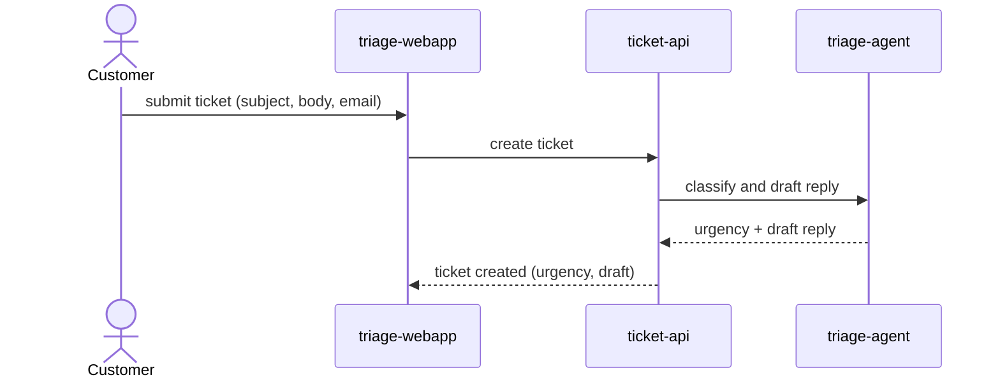

# Ticket submission and triage

A customer submits a ticket, and it is classified and drafted before any support agent sees it.

```mermaid
sequenceDiagram
    actor Customer
    participant triage-webapp
    participant ticket-api
    participant triage-agent

    Customer->>triage-webapp: submit ticket (subject, body, email)
    triage-webapp->>ticket-api: create ticket
    ticket-api->>triage-agent: classify and draft reply
    triage-agent-->>ticket-api: urgency + draft reply
    ticket-api-->>triage-webapp: ticket created (urgency, draft)
```

